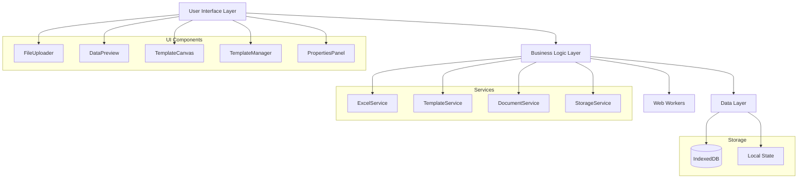

# Design Document

## Overview

The Excel-to-Word Template Generator is a client-side Next.js application that processes Excel files, enables interactive template creation, and generates Word documents. The application emphasizes performance through Web Workers, persistent storage via IndexedDB, and a modular component architecture.

## Architecture

### High-Level Architecture



### Technology Stack

- **Framework**: Next.js 14 with App Router
- **Language**: TypeScript
- **Styling**: Tailwind CSS
- **Excel Processing**: SheetJS (xlsx)
- **Document Generation**: docx library
- **Storage**: IndexedDB via dexie.js
- **Performance**: Web Workers for heavy operations

## Components and Interfaces

### Core Components

#### FileUploader Component
```typescript
interface FileUploaderProps {
  onFileUpload: (data: ExcelData) => void;
  onError: (error: string) => void;
}

interface ExcelData {
  headers: string[];
  rows: Record<string, any>[];
  sheetNames: string[];
  selectedSheet: string;
}
```

**Responsibilities:**
- Handle file input and validation
- Parse Excel files using SheetJS
- Display sheet selection for multi-sheet files
- Emit parsed data to parent components

#### DataPreview Component
```typescript
interface DataPreviewProps {
  data: ExcelData | null;
  isLoading: boolean;
}
```

**Responsibilities:**
- Display Excel data in tabular format
- Handle large datasets with virtualization
- Show data statistics (row count, column count)

#### TemplateCanvas Component
```typescript
interface TemplateCanvasProps {
  paperFormat: PaperFormat;
  availableFields: FieldDefinition[];
  template: Template | null;
  onTemplateChange: (template: Template) => void;
}

interface Template {
  id: string;
  name: string;
  paperFormat: PaperFormat;
  elements: TemplateElement[];
  createdAt: Date;
  updatedAt: Date;
}

interface TemplateElement {
  id: string;
  fieldName: string;
  x: number;
  y: number;
  width: number;
  height: number;
  styles: ElementStyles;
}

interface ElementStyles {
  fontSize: number;
  fontWeight: 'normal' | 'bold';
  textAlign: 'left' | 'center' | 'right';
  fontFamily: string;
}
```

**Responsibilities:**
- Render interactive canvas with paper format dimensions
- Handle drag-and-drop operations
- Manage element positioning and selection
- Real-time template preview

#### TemplateManager Component
```typescript
interface TemplateManagerProps {
  currentTemplate: Template | null;
  onSave: (name: string) => Promise<void>;
  onLoad: (template: Template) => void;
  onDelete: (templateId: string) => Promise<void>;
}
```

**Responsibilities:**
- List saved templates
- Handle template CRUD operations
- Template import/export functionality

#### PropertiesPanel Component
```typescript
interface PropertiesPanelProps {
  selectedElement: TemplateElement | null;
  onStyleChange: (elementId: string, styles: Partial<ElementStyles>) => void;
}
```

**Responsibilities:**
- Display styling options for selected elements
- Real-time style updates
- Style presets and custom styling

### Service Layer

#### ExcelService
```typescript
class ExcelService {
  static async parseFile(file: File): Promise<ExcelData>;
  static validateFile(file: File): boolean;
  static getSheetData(workbook: any, sheetName: string): ExcelData;
}
```

#### TemplateService
```typescript
class TemplateService {
  static createTemplate(name: string, elements: TemplateElement[], paperFormat: PaperFormat): Template;
  static validateTemplate(template: Template): boolean;
  static cloneTemplate(template: Template): Template;
}
```

#### DocumentService
```typescript
class DocumentService {
  static async generateDocument(template: Template, data: ExcelData): Promise<Blob>;
  static createDocumentWorker(): Worker;
  static substituteFields(text: string, rowData: Record<string, any>): string;
}
```

#### StorageService
```typescript
class StorageService {
  static async saveTemplate(template: Template): Promise<void>;
  static async loadTemplate(id: string): Promise<Template>;
  static async listTemplates(): Promise<Template[]>;
  static async deleteTemplate(id: string): Promise<void>;
}
```

## Data Models

### Database Schema (IndexedDB)

```typescript
// Dexie.js schema
class TemplateDatabase extends Dexie {
  templates!: Table<Template>;
  
  constructor() {
    super('TemplateGeneratorDB');
    this.version(1).stores({
      templates: '++id, name, createdAt, updatedAt'
    });
  }
}
```

### Paper Format Definitions
```typescript
interface PaperFormat {
  name: string;
  width: number;  // in pixels at 96 DPI
  height: number; // in pixels at 96 DPI
  widthMM: number;
  heightMM: number;
}

const PAPER_FORMATS: Record<string, PaperFormat> = {
  A4: { name: 'A4', width: 794, height: 1123, widthMM: 210, heightMM: 297 },
  A5: { name: 'A5', width: 559, height: 794, widthMM: 148, heightMM: 210 },
  Letter: { name: 'Letter', width: 816, height: 1056, widthMM: 216, heightMM: 279 }
};
```

### System Fields
```typescript
const SYSTEM_FIELDS: FieldDefinition[] = [
  { name: '{{currentDate}}', type: 'system', description: 'Current date' },
  { name: '{{currentTime}}', type: 'system', description: 'Current time' },
  { name: '{{pageNumber}}', type: 'system', description: 'Page number' },
  { name: '{{totalPages}}', type: 'system', description: 'Total pages' }
];
```

## Error Handling

### Error Types and Handling Strategy

```typescript
enum ErrorType {
  FILE_UPLOAD = 'FILE_UPLOAD',
  EXCEL_PARSING = 'EXCEL_PARSING',
  TEMPLATE_SAVE = 'TEMPLATE_SAVE',
  TEMPLATE_LOAD = 'TEMPLATE_LOAD',
  DOCUMENT_GENERATION = 'DOCUMENT_GENERATION',
  STORAGE_ERROR = 'STORAGE_ERROR'
}

interface AppError {
  type: ErrorType;
  message: string;
  details?: any;
  timestamp: Date;
}
```

### Error Handling Components

#### ErrorBoundary
- Catch React component errors
- Display fallback UI
- Log errors for debugging

#### Toast Notification System
- Display user-friendly error messages
- Success confirmations
- Progress indicators for long operations

### Specific Error Scenarios

1. **File Upload Errors**
   - Invalid file format → Show supported formats
   - File too large → Display size limits
   - Corrupted file → Suggest file repair

2. **Storage Errors**
   - IndexedDB unavailable → Fallback to localStorage with warnings
   - Storage quota exceeded → Template cleanup suggestions
   - Database corruption → Reset option with data export

3. **Document Generation Errors**
   - Memory limitations → Batch processing
   - Template validation failures → Highlight problematic elements
   - Export failures → Retry mechanism

## Testing Strategy

### Unit Testing
- **Components**: React Testing Library for UI components
- **Services**: Jest for business logic testing
- **Utilities**: Pure function testing

### Integration Testing
- **File Processing**: Test Excel parsing with various file formats
- **Template Operations**: Test save/load/delete workflows
- **Document Generation**: Test end-to-end document creation

### Performance Testing
- **Large File Handling**: Test with files containing 1000+ rows
- **Memory Usage**: Monitor memory consumption during operations
- **Web Worker Performance**: Measure processing time improvements

### Browser Compatibility Testing
- **IndexedDB Support**: Test across different browsers
- **File API Support**: Verify drag-and-drop functionality
- **Web Worker Support**: Ensure background processing works

### Test Data
```typescript
// Mock Excel data for testing
const mockExcelData: ExcelData = {
  headers: ['Name', 'Email', 'Phone', 'Department'],
  rows: [
    { Name: 'John Doe', Email: 'john@example.com', Phone: '123-456-7890', Department: 'IT' },
    { Name: 'Jane Smith', Email: 'jane@example.com', Phone: '098-765-4321', Department: 'HR' }
  ],
  sheetNames: ['Sheet1'],
  selectedSheet: 'Sheet1'
};
```

### Performance Optimization

#### Web Workers Implementation
```typescript
// document-generator.worker.ts
self.onmessage = function(e) {
  const { template, data } = e.data;
  
  // Heavy document generation logic
  const document = generateDocumentSync(template, data);
  
  self.postMessage({ success: true, document });
};
```

#### Virtual Scrolling for Large Datasets
- Implement virtual scrolling in DataPreview
- Lazy load template elements
- Optimize canvas rendering for complex templates

#### Caching Strategy
- Cache parsed Excel data in memory
- Template thumbnail generation and caching
- Memoize expensive calculations

This design provides a robust foundation for the Excel-to-Word template generator, emphasizing performance, user experience, and maintainability while meeting all the specified requirements.